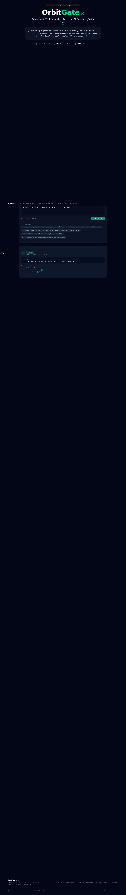

<p align="center"></p>

# OrbitGate

[](https://github.com/kyal102/orbitgate/actions/workflows/ci.yml)   

**A public local demo for deterministic verification of orbital and satellite claims.**

OrbitGate checks AI-generated space, satellite, and orbital-mechanics claims before they are treated as trustworthy. It routes claims through deterministic gates, records evidence, and exposes replayable benchmark artifacts so reviewers can see what was checked and why.

This repository is the **free local / open-source lite edition**. It is intended for product evaluation, developer testing, education, and integration demos. The paid JARVI3 deployment can embed OrbitGate inside the Packages Labs tab at `/orbitgate/`.

> OrbitGate is research software. It is not flight software, mission-control software, a certified orbital-dynamics tool, or a substitute for qualified aerospace review.

## Quick Start

Install Bun and Python, clone the repo, then run:

```bash
cp .env.example .env
bun install --frozen-lockfile
bun run db:generate
bun run db:push
bun run dev
```

Open `http://localhost:3000`.

On Windows PowerShell:

```powershell
Copy-Item .env.example .env
bun install --frozen-lockfile
bun run db:generate
bun run db:push
bun run dev
```

## CLI Demo

```bash
python -m orbitgate.orbit_cli --demo
python -m orbitgate.orbit_cli --run --json orbitgate_report.json --html orbitgate_report.html
python -m pytest tests -q
```

## What You Can Try

- Claim checks for orbital mechanics, delta-v, TLEs, conjunction risk, satellite power, thermal constraints, comms, deorbit claims, and mission design.
- Evidence packs, benchmark dashboards, replay views, certificates, and claim-boundary panels.
- A local Next.js dashboard backed by Prisma and SQLite demo storage.
- A Python package that can run deterministic benchmark and replay commands locally.

## JARVI3 Integration

JARVI3 can embed this app from Packages Labs via a same-origin iframe:

```text
/orbitgate/
```

During Railway builds, JARVI3 can clone this public repo into `gates/orbitgate`, install Bun dependencies, start the Next.js app on an internal port, and proxy `/orbitgate/`, `/_next/`, and `/api/orbitgate/` traffic from the main FastAPI app.

## Documentation

- [Local quick start](docs/LOCAL_QUICKSTART.md)
- [Safety and flight-use boundary](docs/SAFETY.md)
- [Claim boundary](docs/ORBITGATE_CLAIM_BOUNDARY.md)
- [Limitations](docs/ORBITGATE_LIMITATIONS.md)
- [Reproduction guide](docs/ORBITGATE_REPRODUCTION.md)

## Ecosystem

Part of the public JARVI3 Gate ecosystem: ClaimGate, ClaimLint, UnitGate, EvidencePack, ReplayGate, ChipGate, MedGate, and OrbitGate.

**AI proposes. Gates verify. Evidence records. Replay checks drift.**
